# DWDM Optical Engineering Knowledge Base

A comprehensive reference for Dense Wavelength Division Multiplexing (DWDM) optical networking concepts, formulas, and system design principles. This document is intended as a self-contained knowledge base for engineers, developers, and AI systems working with optical network planning and simulation.

---

## Table of Contents

1. [Fundamentals of DWDM](#1-fundamentals-of-dwdm)
2. [Fiber Propagation Physics](#2-fiber-propagation-physics)
3. [Nonlinear Interference](#3-nonlinear-interference-nli)
4. [Raman Effects](#4-raman-effects)
5. [Optical Amplification](#5-optical-amplification)
6. [Signal Quality Metrics](#6-signal-quality-metrics)
7. [Network Elements](#7-network-elements)
8. [Spectral Information Model](#8-spectral-information-model)
9. [Network Design and Planning](#9-network-design-and-planning)
10. [Transceiver Modes and Modulation Formats](#10-transceiver-modes-and-modulation-formats)
11. [End-to-End Propagation Simulation](#11-end-to-end-propagation-simulation)
12. [Reference Tables and Constants](#12-reference-tables-and-constants)
13. [Glossary](#13-glossary)

---

## 1. Fundamentals of DWDM

### 1.1 Wavelength Division Multiplexing

Wavelength Division Multiplexing (WDM) transmits multiple optical signals simultaneously over a single fiber by assigning each signal a different wavelength (color) of light. DWDM uses closely spaced channels in the infrared spectrum, enabling dozens to hundreds of independent channels on one fiber.

The usable spectrum in silica fiber is divided into bands:


- **C-Band** (Conventional): The primary DWDM operating window. Lowest fiber loss, mature amplifier technology (EDFA).
- **L-Band** (Long): Extended capacity band. Used when C-band is fully occupied.
- **S-Band** (Short): Emerging for next-generation capacity expansion.

### 1.2 ITU-T Frequency Grid

The ITU-T G.694.1 standard defines the channel plan for DWDM systems. All channels are referenced to an anchor frequency with a finest granularity of 6.25 GHz:

$$f_n = 193.1 \text{ THz} + n \times 6.25 \text{ GHz}$$

where $n$ is any integer (positive, negative, or zero).

**Common grid spacings:**

| Spacing | Channels in C-band (~4.8 THz) | Use Case |
|---------|-------------------------------|----------|
| 100 GHz | ~48 | Legacy fixed-grid |
| 50 GHz | ~96 | Standard DWDM |
| 25 GHz | ~192 | High-density DWDM |
| 12.5 GHz | ~384 | Flexible grid |
| 6.25 GHz | ~768 | Finest granularity |

**Flexible Grid (Flexi-Grid):** Each channel occupies a slot defined by a center frequency and a slot width that is a multiple of 12.5 GHz. This enables mixed-rate systems where 400G channels can coexist with 100G channels using different slot widths.

### 1.3 Frequency and Wavelength

Frequency and wavelength are related through the speed of light:

$$f = \frac{c}{\lambda}, \quad \lambda = \frac{c}{f}$$

where:
- $f$ = frequency (Hz)
- $\lambda$ = wavelength (m)
- $c$ = speed of light in vacuum ($2.998 \times 10^8$ m/s)

**Convention:** Channel planning uses frequency (THz) for precision. Fiber properties (attenuation, dispersion) are often specified at a reference wavelength (typically 1550 nm = 193.41 THz).

### 1.4 Power Units and Conversions

Optical power is expressed in both linear and logarithmic units:

$$P_{\text{dBm}} = 10 \log_{10}\!\left(\frac{P_{\text{mW}}}{1 \text{ mW}}\right)$$

$$P_{\text{W}} = 10^{P_{\text{dBm}}/10} \times 10^{-3}$$

**General dB conversions (ratios):**

$$\text{lin2db}(x) = 10 \log_{10}(x)$$

$$\text{db2lin}(x) = 10^{x/10}$$

**Power Spectral Density (PSD):** Power per unit frequency bandwidth, typically expressed in mW/GHz or W/Hz. For a channel with baud rate $B$:

$$P_{\text{dBm}} = 10 \log_{10}(B \times \text{PSD}_{\text{mW/GHz}} \times 10^{-9})$$

**Quick reference:**

| dBm | mW | W |
|-----|-----|------|
| +23 | 200 | 0.2 |
| +20 | 100 | 0.1 |
| +3 | 2 | 0.002 |
| 0 | 1 | 0.001 |
| -3 | 0.5 | 0.0005 |
| -10 | 0.1 | 0.0001 |
| -20 | 0.01 | 0.00001 |

---

## 2. Fiber Propagation Physics

### 2.1 Fiber Attenuation

Optical power decays exponentially as it propagates through fiber:

$$P(z) = P(0) \cdot e^{-\alpha z}$$

where:
- $P(z)$ = power at distance $z$ (W)
- $\alpha$ = attenuation coefficient (Neper/m)
- $z$ = distance along fiber (m)

**Conversion from dB/km to Neper/m:**

$$\alpha_{\text{Np/m}} = \frac{\alpha_{\text{dB/km}}}{10 \log_{10}(e) \times 10^3} \approx \frac{\alpha_{\text{dB/km}}}{4343}$$

**Total span loss** includes fiber attenuation, connector losses, and any inline lumped losses:

$$L_{\text{total}} = \alpha_{\text{dB/km}} \times L_{\text{km}} + L_{\text{con,in}} + L_{\text{con,out}} + \sum L_{\text{lumped}}$$

Typical attenuation at 1550 nm: 0.2 dB/km for standard single-mode fiber (SSMF). Attenuation is frequency-dependent and can be modeled with an interpolation function over the operating band.

### 2.2 Chromatic Dispersion (CD)

Different wavelengths travel at different group velocities in fiber, causing pulse broadening. The dispersion parameter $D$ (ps/nm/km) relates to the propagation constant:

$$\beta_2(f) = -\frac{(c / f)^2 \cdot D(f)}{2\pi c}$$

where:
- $\beta_2$ = group velocity dispersion (s$^2$/m)
- $D$ = dispersion coefficient (s/m$^2$, typically expressed as ps/(nm$\cdot$km))
- $f$ = optical frequency (Hz)

**Dispersion with slope:**

$$D(\lambda) = D(\lambda_{\text{ref}}) + S \cdot (\lambda - \lambda_{\text{ref}})$$

where $S$ is the dispersion slope (ps/nm$^2$/km).

**Accumulated CD over fiber length $L$:**

$$\text{CD}_{\text{acc}} = \left[\beta_2 + 2\pi \beta_3 (f - f_{\text{ref}})\right] \cdot \frac{2\pi f_{\text{ref}}^2}{c} \cdot L$$

where $\beta_3$ captures higher-order dispersion. Units: ps/nm (or equivalently, s/m after appropriate scaling).

### 2.3 Polarization Mode Dispersion (PMD)

Fiber birefringence causes a random differential group delay (DGD) between orthogonal polarization modes. PMD accumulates statistically:

**Single span:**

$$\Delta\tau = \text{PMD\_coef} \times \sqrt{L}$$

where:
- $\Delta\tau$ = differential group delay (s)
- $\text{PMD\_coef}$ = PMD coefficient (s/$\sqrt{\text{m}}$), typically 0.04 ps/$\sqrt{\text{km}}$
- $L$ = fiber length (m)

**Multi-element accumulation (root-sum-of-squares):**

$$\text{PMD}_{\text{total}} = \sqrt{\text{PMD}_1^2 + \text{PMD}_2^2 + \cdots + \text{PMD}_N^2}$$

### 2.4 Polarization Dependent Loss (PDL)

PDL is the ratio of maximum to minimum transmission through an element, expressed in dB. It accumulates statistically across elements:

$$\text{PDL}_{\text{total}} \approx \sqrt{\text{PDL}_1^2 + \text{PDL}_2^2 + \cdots + \text{PDL}_N^2}$$

### 2.5 Nonlinear Coefficient

The Kerr effect causes the refractive index to depend on light intensity. The strength of fiber nonlinearity is captured by:

$$\gamma(f) = \frac{2\pi f \cdot n_2}{c \cdot A_{\text{eff}}}$$

where:
- $\gamma$ = nonlinear coefficient (1/(W$\cdot$m))
- $n_2$ = nonlinear refractive index ($\approx 2.6 \times 10^{-20}$ m$^2$/W for silica)
- $A_{\text{eff}}$ = effective mode area (m$^2$)

Typical value for SSMF: $\gamma \approx 1.3$ (W$\cdot$km)$^{-1}$ at 1550 nm.

### 2.6 Effective Length

Nonlinear effects are significant only where optical power is high. The effective length captures this:

$$L_{\text{eff}} = \frac{1 - e^{-\alpha L}}{\alpha}$$

For long fibers ($\alpha L \gg 1$), this saturates at the asymptotic length:

$$L_{\text{eff}} \to L_{\text{asym}} = \frac{1}{\alpha}$$

For $\alpha = 0.046$ Np/km (0.2 dB/km), $L_{\text{asym}} \approx 21.7$ km.

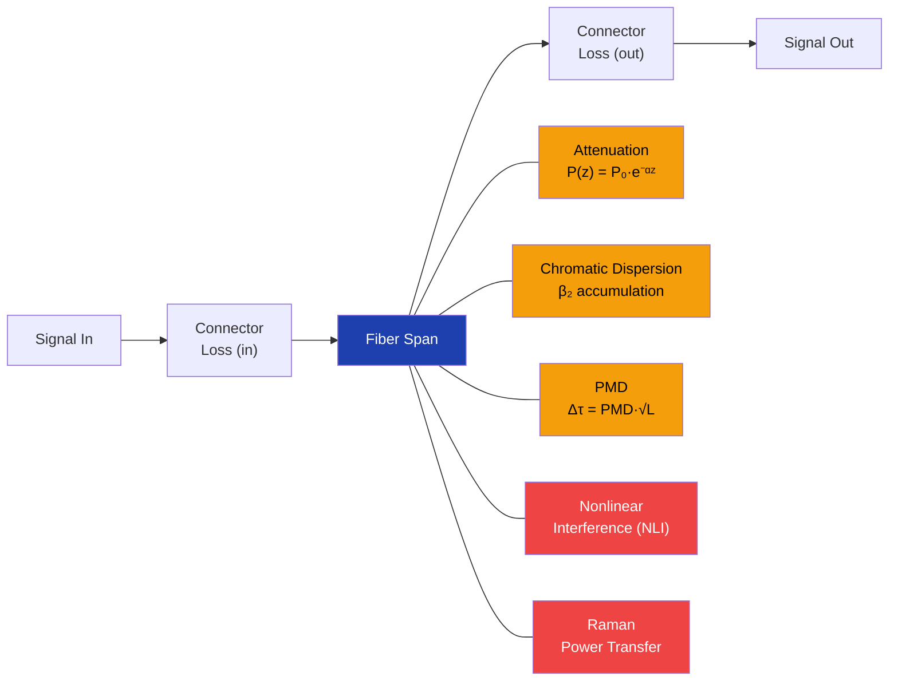

---

## 3. Nonlinear Interference (NLI)

### 3.1 Kerr Nonlinear Effects

In a WDM system, the Kerr effect produces three types of nonlinear interference:

- **Self-Phase Modulation (SPM):** A channel's own intensity modulates its own phase.
- **Cross-Phase Modulation (XPM):** Other channels' intensities modulate the phase of the channel under test.
- **Four-Wave Mixing (FWM):** Interaction between three frequencies generates a fourth frequency component.

In modern coherent systems with high-cardinality modulation (16QAM, 64QAM), NLI can be modeled as additive Gaussian noise. This is the foundation of the GN and GGN models.

### 3.2 The GN Model (Gaussian Noise Model)

The GN model (Poggiolini et al., 2014) computes NLI power as a function of channel powers, fiber parameters, and spectral arrangement.

**NLI power per channel under test (CUT):**

$$P_{\text{NLI}}(f_{\text{cut}}) = \sum_{\text{pump}} P_{\text{cut}} \cdot P_{\text{pump}}^2 \cdot \eta(f_{\text{cut}}, f_{\text{pump}})$$

where $\eta$ is the NLI efficiency coefficient:

$$\eta = \frac{\gamma^2 \cdot w \cdot \psi}{B_{\text{cut}} \cdot B_{\text{pump}}^2}$$

- $\gamma$ = fiber nonlinear coefficient
- $w$ = polarization weight factor:
  - SPM: $w = 16/27 \approx 0.593$
  - XPM: $w = 32/27 \approx 1.185$
- $B_{\text{cut}}$, $B_{\text{pump}}$ = baud rates of CUT and pump channels

**The psi ($\psi$) function:**

$$\psi = \frac{L_{\text{eff}}^2}{2\pi |\beta_2| L_{\text{asym}}} \left[\text{arcsinh}\!\left(\pi^2 L_{\text{asym}} |\beta_2| B_{\text{cut}} \cdot f_R\right) - \text{arcsinh}\!\left(\pi^2 L_{\text{asym}} |\beta_2| B_{\text{cut}} \cdot f_L\right)\right]$$

where:
- $f_R = \Delta f + B_{\text{pump}}/2$, $f_L = \Delta f - B_{\text{pump}}/2$
- $\Delta f$ = frequency separation between CUT and pump
- $L_{\text{asym}} = 1/\alpha$ (asymptotic effective length)

### 3.3 The GGN Model (Generalized Gaussian Noise)

The GGN model extends the GN model to account for:
- **Non-flat channel spectra** (raised-cosine pulse shaping)
- **Raman gain profiles** along the fiber (non-uniform power evolution)
- **Frequency-dependent fiber parameters** ($\gamma$, $\beta_2$, $\alpha$)

The generalized NLI integral becomes:

$$\psi_{\text{gen}} = \int\!\!\int \text{RC}(f_1) \cdot \text{RC}(f_2) \cdot |\rho_{\text{NLI}}(f_1, f_2)|^2 \, df_1 \, df_2$$

where $\rho_{\text{NLI}}$ is the generalized NLI field profile accounting for Raman-induced power variations along the fiber, and $\text{RC}(f)$ is the raised cosine spectral shape.

Two approximation levels are commonly used:
- **Spectrally Separated**: Full double integral with raised-cosine shaping per channel pair
- **Approximate (Closed-Form)**: Asymptotic expressions for well-separated channels, reducing computational cost

### 3.4 Raised Cosine Spectral Shaping

The raised cosine defines the spectral shape of a modulated channel:

$$\text{RC}(f) = \begin{cases} 1 & |f - f_c| \leq \frac{(1-\alpha_r)B}{2} \\[6pt] \frac{1}{2}\left[1 + \cos\!\left(\frac{\pi}{B\alpha_r}\left(|f - f_c| - \frac{(1-\alpha_r)B}{2}\right)\right)\right] & \frac{(1-\alpha_r)B}{2} < |f - f_c| < \frac{(1+\alpha_r)B}{2} \\[6pt] 0 & |f - f_c| \geq \frac{(1+\alpha_r)B}{2} \end{cases}$$

where:
- $f_c$ = channel center frequency
- $B$ = baud rate (symbol rate)
- $\alpha_r$ = roll-off factor (0 to 1). Typical value: 0.15

The total occupied bandwidth is $(1 + \alpha_r) \cdot B$.

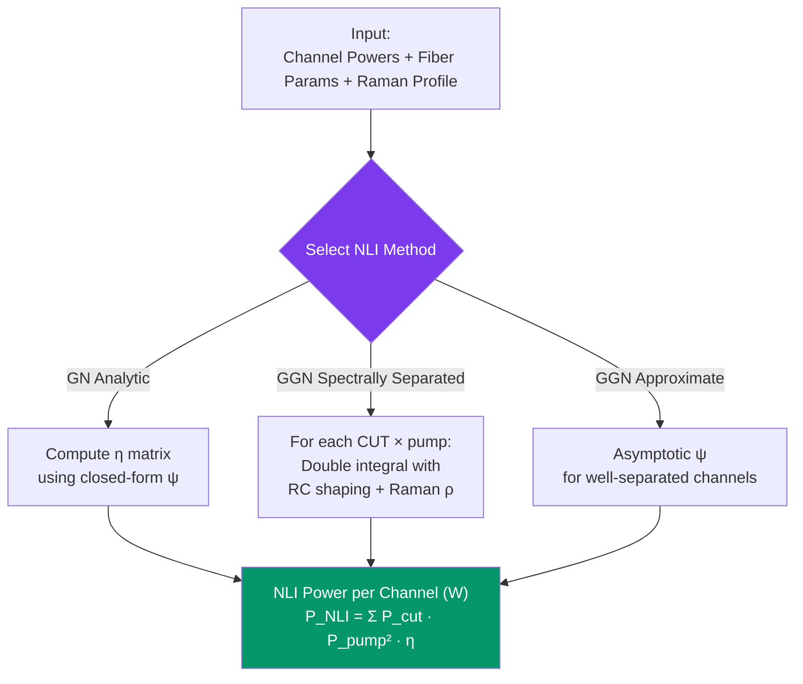

---

## 4. Raman Effects

### 4.1 Stimulated Raman Scattering (SRS)

SRS transfers energy from shorter-wavelength (higher-frequency) channels to longer-wavelength channels through photon-phonon interaction in the fiber. This creates a power tilt across the WDM spectrum.

**Raman coupling coefficient:**

$$c_r(f_i, f_j) = \frac{\gamma_{\text{Raman}}(f_i - f_j) \cdot f_i}{A_{\text{eff,overlap}}}$$

where:
- $\gamma_{\text{Raman}}(\Delta f)$ = normalized Raman gain spectrum (measured profile, peak at ~13 THz offset)
- $A_{\text{eff,overlap}}$ = effective area overlap between interacting modes

**The SRS coupled differential equation (per channel $i$):**

$$\frac{dP_i}{dz} = P_i\left(-\alpha_i + \sum_j c_r(f_i, f_j) \cdot P_j(z)\right)$$

This captures both gain (from higher-frequency channels) and depletion (toward lower-frequency channels) simultaneously.

### 4.2 Perturbative Raman Solver

For moderate SRS tilt, a perturbative expansion provides an efficient solution:

$$P_i(z) = P_{i,0} \cdot e^{-\alpha_i z + \gamma_1(z) + \gamma_2(z) + \gamma_3(z) + \gamma_4(z)}$$

**Order 1** (dominant effect):

$$\gamma_1(z) = \sum_j c_{r,ij} \cdot P_{j,0} \cdot L_{\text{eff},j}(z)$$

**Order 2** (gain-on-gain correction):

$$\gamma_2(z) = \sum_j c_{r,ij} \int_0^z e^{-\alpha_j z'} \gamma_{1,j}(z') \, dz'$$

**Order 3:**

$$\gamma_3(z) = \sum_j c_{r,ij} \int_0^z e^{-\alpha_j z'} \left[\gamma_{2,j}(z') + \tfrac{1}{2}\gamma_{1,j}(z')^2\right] dz'$$

**Order 4:**

$$\gamma_4(z) = \sum_j c_{r,ij} \int_0^z e^{-\alpha_j z'} \left[\gamma_{3,j}(z') + \gamma_{1,j}(z')\gamma_{2,j}(z') + \tfrac{1}{6}\gamma_{1,j}(z')^3\right] dz'$$

Higher orders provide progressively more accurate results at higher computational cost. Order 2 is sufficient for most practical scenarios.

### 4.3 Numerical Raman Solver

For high accuracy or strong Raman regimes, direct step-by-step integration of the coupled ODEs:

$$P_i(z + \Delta z) = P_i(z) \cdot \left[1 + \left(-\alpha_i + \sum_j c_{r,ij} \cdot P_j(z)\right) \Delta z\right] \cdot L_{\text{lumped}}(z)$$

where $L_{\text{lumped}}$ accounts for any discrete losses at position $z$. The solver iterates until convergence (residue tolerance ~$10^{-6}$).

### 4.4 Spontaneous Raman Scattering

The Raman process also generates spontaneous emission noise, governed by the Bose-Einstein phonon distribution:

$$P_{\text{SpRS},i} = 2 h B_i f_i (1 + \eta_{\text{BE}}) \cdot c_r(f_i, f_{\text{pump}}) \cdot \int_0^L \frac{P_{\text{pump}}(z)}{\text{loss}_i(z)} \, dz$$

where the Bose-Einstein thermal factor:

$$\eta_{\text{BE}} = \frac{-1}{1 - e^{h \Delta f / (k_B T)}}$$

- $h$ = Planck's constant
- $k_B$ = Boltzmann's constant
- $T$ = fiber temperature (K)
- $\Delta f$ = frequency offset between pump and signal
- Factor of 2 accounts for dual polarization

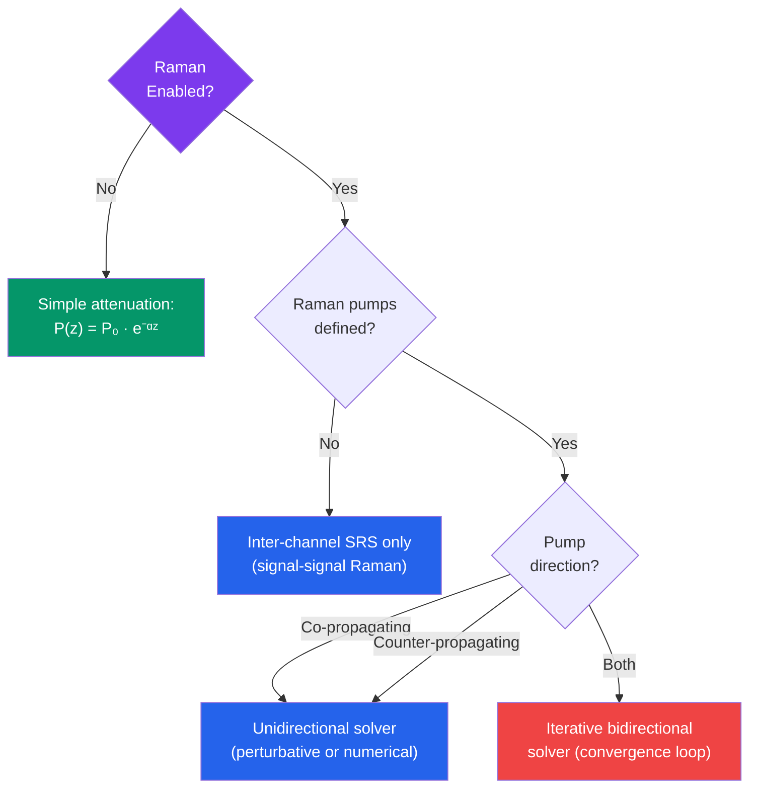

---

## 5. Optical Amplification

### 5.1 EDFA Fundamentals

The Erbium-Doped Fiber Amplifier (EDFA) is the workhorse of DWDM networks. It provides optical-domain amplification across the C-band (~1530-1565 nm) or L-band (~1565-1625 nm) without optical-to-electrical conversion.

**Key parameters:**
- **Gain** ($G$): Signal amplification factor (dB). Typical: 15-35 dB.
- **Noise Figure** (NF): SNR degradation caused by the amplifier (dB). Typical: 4-7 dB.
- **Maximum Output Power** ($P_{\text{max}}$): Saturation limit (dBm). Typical: 21-25 dBm.
- **Gain bandwidth**: Frequency range over which the amplifier operates.

### 5.2 Amplifier Noise -- ASE

Amplified Spontaneous Emission (ASE) is the dominant noise source in optically amplified links. The ASE power generated by an amplifier, integrated over the signal bandwidth:

$$P_{\text{ASE}} = h \cdot f \cdot B_{\text{signal}} \cdot \text{NF}_{\text{linear}}$$

where:
- $h = 6.626 \times 10^{-34}$ J$\cdot$s (Planck's constant)
- $f$ = signal center frequency (Hz)
- $B_{\text{signal}}$ = signal bandwidth / baud rate (Hz)
- $\text{NF}_{\text{linear}} = 10^{\text{NF}_{\text{dB}}/10}$

**Physical interpretation:** The quantum-limited minimum noise figure is 3 dB (one spontaneous emission photon per mode). Practical EDFAs achieve 4-6 dB.

### 5.3 Noise Figure Models

**Fixed Gain Model:** Constant NF regardless of operating point.

**Variable Gain (Two-Stage) Model:**

$$\text{NF}_{\text{avg}} = 10\log_{10}\!\left(10^{\text{NF}_1/10} + \frac{10^{\text{NF}_2/10}}{10^{G_1/10}}\right)$$

where:
- $\text{NF}_1$ = first stage (preamp) noise figure
- $\text{NF}_2$ = second stage (booster) noise figure
- $G_1$ = first stage gain

This is Friis' formula applied to cascaded optical amplifiers: the first stage dominates the overall noise figure when its gain is high.

**Dual-Stage Cascade:**

$$\text{NF}_{\text{total}} = \text{NF}_1 + \frac{\text{NF}_2}{G_1} \quad \text{(linear units)}$$

In dB:

$$\text{NF}_{\text{total,dB}} = 10\log_{10}\!\left(10^{\text{NF}_{1}/10} + 10^{(\text{NF}_{2} - G_{1})/10}\right)$$

### 5.4 Gain Profile, Tilt, and Ripple

Real EDFAs do not have perfectly flat gain across frequency:

- **Gain Ripple:** Fixed spectral variation inherent to the EDFA design (dB vs frequency).
- **Dynamic Gain Tilt (DGT):** Gain slope that varies with the amplifier operating point.
- **NF Ripple:** Frequency-dependent noise figure variation.
- **VOA (Variable Optical Attenuator):** Input/output attenuators for power management.

The effective gain at each frequency:

$$G(f) = G_{\text{flatmax}} + \text{ripple}(f) + \text{DGT}(f) \times s - \text{VOA}$$

where $s$ is a scaling factor derived from the tilt target setting.

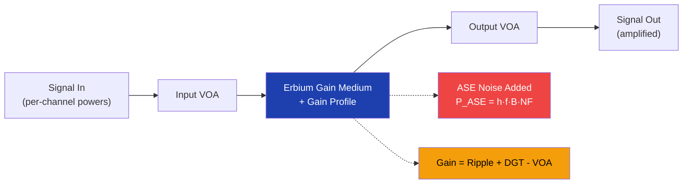

### 5.5 Raman Amplification

Distributed Raman amplification uses the transmission fiber itself as the gain medium by injecting pump lasers (typically at ~1450 nm for C-band amplification).

**Advantages over EDFA-only:**
- Lower effective noise figure (gain occurs where signal power is lowest)
- More uniform power profile along the fiber
- Extended reach between amplifier sites

**Configurations:**
- **Counter-propagating pumps:** Most common; pump travels opposite to signal. Lower noise.
- **Co-propagating pumps:** Pump travels with signal. Can cause noise transfer from pump RIN.
- **Hybrid Raman + EDFA:** Raman provides partial gain, EDFA provides the remainder.

---

## 6. Signal Quality Metrics

### 6.1 Signal-to-Noise Ratio (SNR)

The fundamental quality metric: the ratio of signal power to noise power within the signal bandwidth.

$$\text{SNR} = \frac{P_{\text{signal}}}{P_{\text{noise}}}$$

In optical systems, noise has two primary components:
- **ASE noise** from amplifiers
- **NLI noise** from fiber nonlinearity

### 6.2 OSNR (Optical Signal-to-Noise Ratio)

OSNR is the industry-standard metric, normalized to a 0.1 nm reference bandwidth (12.5 GHz at 1550 nm):

$$\text{OSNR}_{0.1\text{nm}} = \text{SNR}_{\text{signal BW}} - 10\log_{10}\!\left(\frac{12.5 \text{ GHz}}{B_{\text{signal}}}\right)$$

This normalization allows comparison between signals with different baud rates. A 100G signal at 32 GBaud and a 400G signal at 64 GBaud can be compared on the same OSNR scale.

### 6.3 GSNR (Generalized Signal-to-Noise Ratio)

GSNR combines both ASE and NLI noise into a single metric. This is the "true" quality indicator for modern coherent systems:

$$\text{GSNR} = \frac{P_{\text{signal}}}{P_{\text{ASE}} + P_{\text{NLI}}}$$

Equivalently, using reciprocal addition:

$$\frac{1}{\text{GSNR}} = \frac{1}{\text{OSNR}_{\text{ASE}}} + \frac{1}{\text{OSNR}_{\text{NLI}}}$$

GSNR determines whether a given transceiver mode (modulation format) is feasible on a path.

### 6.4 Cascaded SNR

When a signal passes through multiple noise sources, the total SNR is computed by adding noise powers:

$$\frac{1}{\text{SNR}_{\text{total}}} = \frac{1}{\text{SNR}_1} + \frac{1}{\text{SNR}_2} + \cdots + \frac{1}{\text{SNR}_N}$$

In dB domain:

$$\text{SNR}_{\text{total,dB}} = -10\log_{10}\!\left(10^{-\text{SNR}_1/10} + 10^{-\text{SNR}_2/10} + \cdots\right)$$

This applies to cascading TX OSNR, per-span ASE/NLI contributions, and ROADM add/drop impairments.

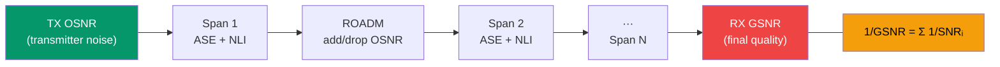

---

## 7. Network Elements

### 7.1 Element Overview

A DWDM network is modeled as a directed graph where each node is a network element. Each element transforms the optical signal passing through it. The core abstraction: every element is a callable that accepts a spectral information object and returns a modified version.

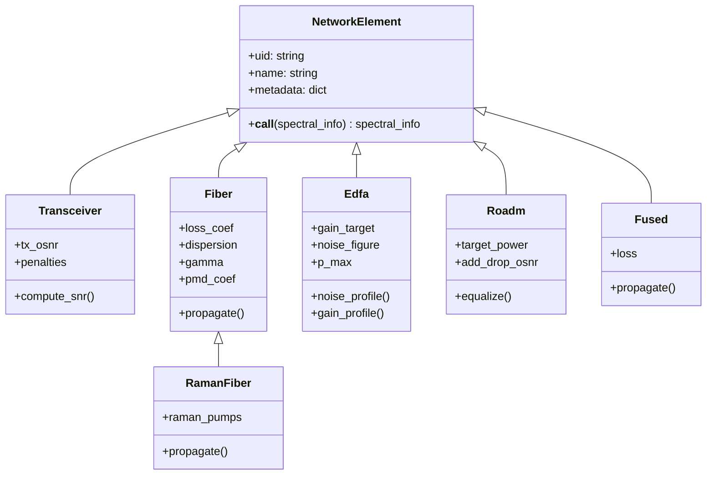

### 7.2 Transceiver

The transceiver is the logical start and end point of a lightpath. At the transmitter side, it generates the WDM signal comb (SpectralInformation). At the receiver side, it computes final quality metrics.

**Transmitter outputs:**
- Per-channel power, frequency, baud rate, roll-off
- TX OSNR (models transmitter noise floor, typically 33-45 dB)

**Receiver computes:**
- GSNR (0.1 nm and signal bandwidth)
- OSNR (ASE-only and NLI-only)
- Accumulated CD, PMD, PDL, latency
- Impairment penalties (CD, PMD, PDL boundary violations)

### 7.3 Optical Fiber

The core propagation element. Applies multiple physical effects to the signal:

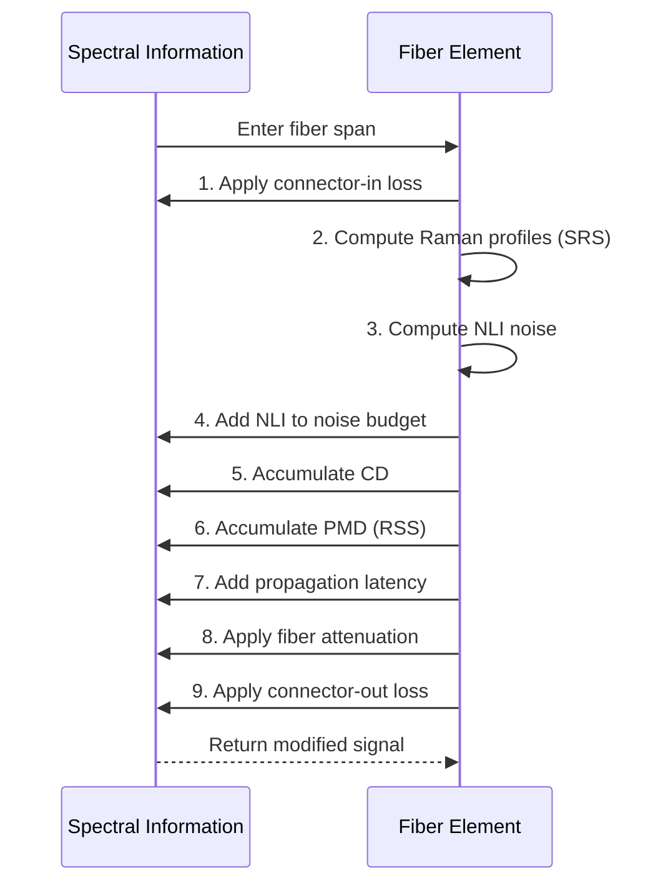

### 7.4 EDFA (Amplifier)

Compensates the loss of the preceding fiber span(s). Key behaviors:
- Applies frequency-dependent gain profile
- Adds ASE noise proportional to NF and gain
- Subject to output power saturation ($P_{\text{max}}$)
- May include input/output VOA for power management

**Amplifier selection during network design:** For each span, the design algorithm selects the amplifier type from the equipment library that provides the required gain with the lowest noise figure, while respecting output power constraints.

### 7.5 ROADM (Reconfigurable Optical Add-Drop Multiplexer)

The key switching and routing node in mesh DWDM networks. ROADMs have multiple degrees (directions) and support three signal paths:

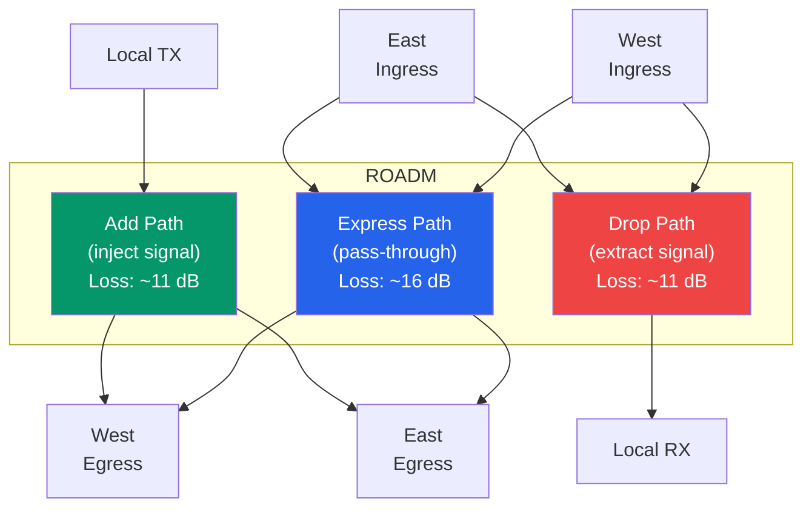

**Power equalization schemes** (applied at each egress degree):

| Scheme | Target | Formula | Use Case |
|--------|--------|---------|----------|
| Fixed power | Same absolute power per channel | $P_{\text{out}} = P_{\text{target}}$ (dBm) | Simple, legacy |
| Constant PSD | Same power spectral density | $P_{\text{out}} = B \times \text{PSD}$ | Mixed baud rates |
| Per-slot width | Power proportional to slot width | $P_{\text{out}} = W_{\text{slot}} \times \text{PSW}$ | Flexible grid |

**ROADM impairments per path type:**
- Insertion loss (dB)
- PMD (ps)
- PDL (dB)
- Chromatic dispersion (ps/nm)
- In-band crosstalk (dB)
- OSNR degradation (add/drop OSNR)

### 7.6 Fused (Passive Coupler)

A simple passive loss element modeling couplers, splitters, or inline connectors. Applies flat attenuation with no noise contribution.

---

## 8. Spectral Information Model

### 8.1 Data Structure

The spectral information object carries all per-channel signal properties as the signal traverses the network:

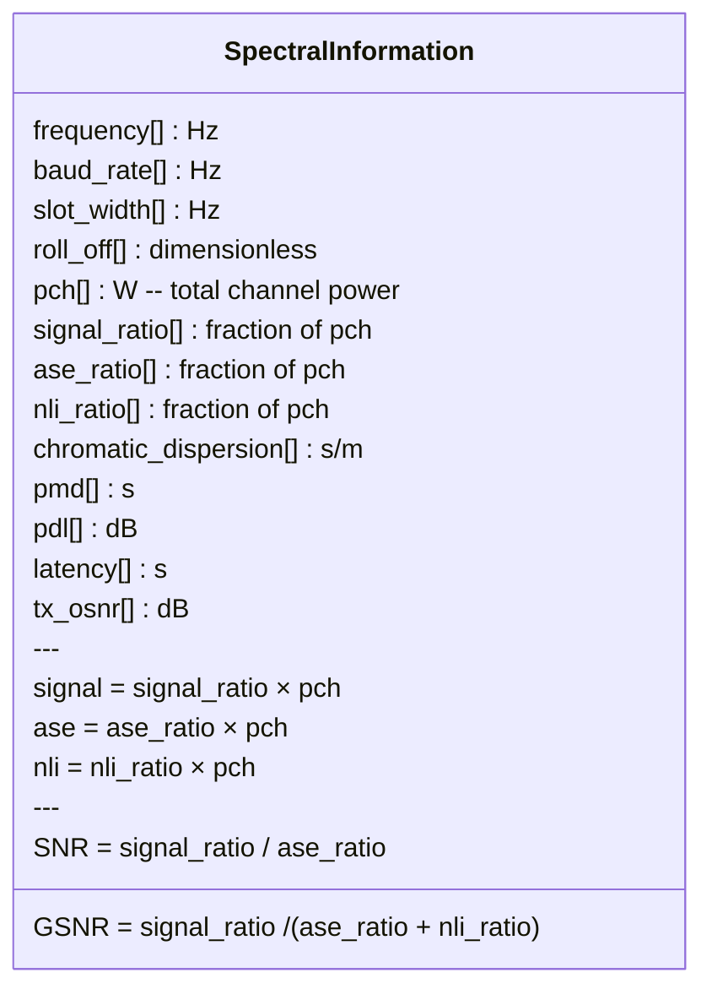

### 8.2 Signal-Noise Ratio Tracking

Power is decomposed into three components via ratios that sum to 1:

$$\text{signal\_ratio} + \text{ase\_ratio} + \text{nli\_ratio} = 1$$

**When NLI is added** (fiber nonlinearity generates noise):

The NLI fraction is computed and all existing ratios are scaled down proportionally:
```
nli_added_ratio = nli_power / pch
signal_ratio *= (1 - nli_added_ratio)
ase_ratio    *= (1 - nli_added_ratio)
nli_ratio     = nli_ratio * (1 - nli_added_ratio) + nli_added_ratio
```

**When ASE is added** (amplifier noise):

Total power increases; signal and NLI ratios decrease:
```
pch_new       = pch + ase_added
signal_ratio *= pch / pch_new
nli_ratio    *= pch / pch_new
ase_ratio     = (ase_ratio * pch + ase_added) / pch_new
pch           = pch_new
```

**When gain or attenuation is applied:**

Total power scales up or down; ratios remain unchanged. This preserves the SNR through passive and amplifying elements (only noise addition degrades SNR).

---

## 9. Network Design and Planning

### 9.1 Network Topology

A DWDM network is represented as a directed graph:
- **Nodes:** Network element instances (Transceiver, ROADM, Fiber, EDFA, Fused)
- **Edges:** Physical connectivity with distance-based weights for routing

An **OMS (Optical Multiplex Section)** is the set of elements between two adjacent ROADMs (or between a Transceiver and a ROADM). Each OMS has an independent spectrum allocation.

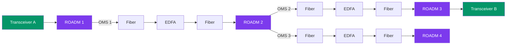

### 9.2 Network Design Pipeline

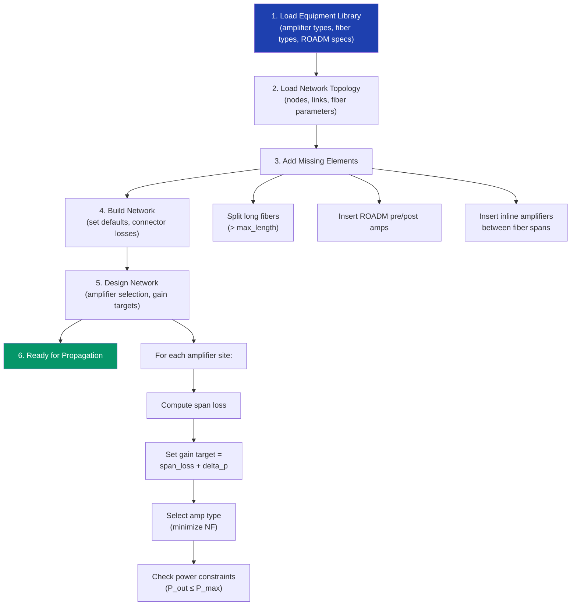

### 9.3 Amplifier Placement and Selection

**Span loss computation:**

$$L_{\text{span}} = \sum_{\text{fibers}} L_{\text{fiber}} + \sum_{\text{fused}} L_{\text{fused}} - \sum_{\text{raman}} G_{\text{raman}}$$

**Gain target:**

$$G_{\text{target}} = L_{\text{span}} + \Delta P + \text{VOA}_{\text{prev}}$$

**Selection criteria** (from equipment library):
1. Gain range: $G_{\text{min}} \leq G_{\text{target}} \leq G_{\text{max}}$
2. Output power: $P_{\text{out}} \leq P_{\text{max}}$
3. Minimize noise figure at the target gain

### 9.4 Path Computation

Paths are computed using shortest-path algorithms (Dijkstra) over the network graph, with optional constraints:

- **Strict nodes:** Path must traverse specific ROADMs/nodes
- **Loose nodes:** Path should traverse specific nodes if possible
- **Link-diverse:** Multiple paths must not share fiber links
- **Node-diverse:** Multiple paths must not share ROADM nodes

### 9.5 Spectrum Assignment

Spectrum slots are assigned using a bitmap per OMS:

**Slot index from frequency:**

$$n = \left\lfloor\frac{f - 193.1 \text{ THz}}{6.25 \text{ GHz}}\right\rfloor$$

**Number of slots needed for a channel:**

$$M = \left\lceil\frac{\text{channel spacing}}{12.5 \text{ GHz}}\right\rceil$$

**First-fit algorithm:** Scan the bitmap from the lowest frequency and assign the first contiguous block of $M$ free slots. This is simple and efficient but can lead to fragmentation.

---

## 10. Transceiver Modes and Modulation Formats

### 10.1 Coherent Detection

Modern DWDM systems use **coherent detection** with digital signal processing (DSP). Key features:
- **Dual-polarization (DP):** Two independent data streams on orthogonal polarizations, doubling spectral efficiency.
- **In-phase/Quadrature (IQ):** Encodes information in both amplitude and phase of the optical field.
- **DSP compensation:** Chromatic dispersion, PMD, and other linear impairments are compensated digitally at the receiver.

### 10.2 Common Modulation Formats

| Format | Bits/Symbol | Typical Baud Rate | Bit Rate | Required OSNR | Relative Reach |
|--------|-------------|-------------------|----------|---------------|----------------|
| DP-QPSK | 4 | 32 GBaud | 100 Gbps | ~12 dB | Long (transoceanic) |
| DP-8QAM | 6 | 42 GBaud | 200 Gbps | ~17 dB | Medium-long |
| DP-16QAM | 8 | 32 GBaud | 200 Gbps | ~19 dB | Medium |
| DP-16QAM | 8 | 64 GBaud | 400 Gbps | ~19 dB | Medium |
| DP-64QAM | 12 | 64 GBaud | 600 Gbps | ~25 dB | Short (metro) |

**Bit rate formula:**

$$R_b = B_{\text{symbol}} \times \log_2(M) \times N_{\text{pol}}$$

where:
- $R_b$ = bit rate (bps)
- $B_{\text{symbol}}$ = symbol rate / baud rate (Baud)
- $M$ = constellation order (4 for QPSK, 16 for 16QAM, etc.)
- $N_{\text{pol}}$ = number of polarizations (2 for DP)

### 10.3 Shannon Capacity Limit

The theoretical maximum information rate for a given SNR (dual-polarization):

$$C = 2 B_{\text{symbol}} \log_2(1 + \text{SNR})$$

Practical systems achieve within 1-3 dB of the Shannon limit. The gap is the **implementation penalty**.

### 10.4 Feasibility and System Margin

A transceiver mode is feasible on a path if:

$$\text{GSNR}_{\text{received}} \geq \text{GSNR}_{\text{required}} + \text{Penalty}_{\text{CD}} + \text{Penalty}_{\text{PMD}} + \text{Penalty}_{\text{PDL}} + \text{Margin}_{\text{system}}$$

**Mode selection strategy:** Choose the highest-capacity format whose required GSNR (plus penalties and margins) can be met by the path. This maximizes throughput while ensuring reliability.

---

## 11. End-to-End Propagation Simulation

### 11.1 Signal Propagation Flow

A complete simulation walks the signal through every element in the path sequentially:

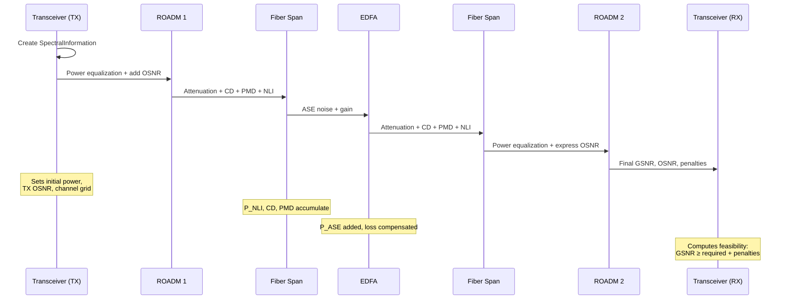

### 11.2 Multi-Span Link Budget Example

Consider a 3-span link with SSMF fiber, 80 km spans, 0.2 dB/km loss, EDFA with 6 dB NF:

| Point | Element | Action | P_ch (dBm) | OSNR (dB) | Notes |
|-------|---------|--------|------------|-----------|-------|
| 0 | TX | Launch | 0.0 | 45.0 | TX OSNR limit |
| 1 | Fiber 1 | -16 dB loss | -16.0 | 45.0 | 80 km × 0.2 dB/km |
| 2 | EDFA 1 | +16 dB gain | 0.0 | 35.2 | NF=6 dB, ASE added |
| 3 | Fiber 2 | -16 dB loss | -16.0 | 35.2 | |
| 4 | EDFA 2 | +16 dB gain | 0.0 | 32.1 | Cascaded ASE |
| 5 | Fiber 3 | -16 dB loss | -16.0 | 32.1 | |
| 6 | EDFA 3 | +16 dB gain | 0.0 | 30.3 | |
| 7 | RX | Receive | 0.0 | ~30.0 | After all penalties |

Each EDFA adds ~$10\log_{10}(h \cdot f \cdot B_{\text{ref}} \cdot \text{NF} \cdot G)$ of ASE noise (in 0.1 nm bandwidth). The OSNR degrades span by span following the cascaded SNR formula.

---

## 12. Reference Tables and Constants

### 12.1 Physical Constants

| Constant | Symbol | Value | Unit |
|----------|--------|-------|------|
| Speed of light (vacuum) | $c$ | $2.998 \times 10^8$ | m/s |
| Planck's constant | $h$ | $6.626 \times 10^{-34}$ | J$\cdot$s |
| Boltzmann's constant | $k_B$ | $1.381 \times 10^{-23}$ | J/K |
| Nonlinear refractive index (silica) | $n_2$ | $\sim 2.6 \times 10^{-20}$ | m$^2$/W |
| OSNR reference bandwidth (0.1 nm) | $B_{\text{ref}}$ | 12.5 | GHz |
| C-band anchor frequency (ITU-T) | $f_0$ | 193.1 | THz |

### 12.2 Typical Fiber Parameters

| Parameter | SSMF (G.652) | NZDF (G.655) | LEAF | Unit |
|-----------|-------------|-------------|------|------|
| Attenuation (1550 nm) | 0.2 | 0.22 | 0.2 | dB/km |
| Dispersion (1550 nm) | 17 | 4.5 | 4.2 | ps/(nm$\cdot$km) |
| Dispersion slope | 0.058 | 0.045 | 0.045 | ps/(nm$^2\cdot$km) |
| Effective area | 80 | 55 | 72 | $\mu$m$^2$ |
| PMD coefficient | 0.04 | 0.04 | 0.04 | ps/$\sqrt{\text{km}}$ |
| Nonlinear coefficient $\gamma$ | 1.3 | 1.9 | 1.5 | (W$\cdot$km)$^{-1}$ |

### 12.3 Unit Conversion Quick Reference

| From | To | Formula |
|------|----|---------|
| dBm | mW | $10^{x/10}$ |
| mW | dBm | $10\log_{10}(x)$ |
| dBm | W | $10^{(x-30)/10}$ |
| dB | linear ratio | $10^{x/10}$ |
| linear ratio | dB | $10\log_{10}(x)$ |
| THz | nm (at 1550 nm) | $\lambda = c / f$ |
| ps/(nm$\cdot$km) | s/m$^2$ | $\times 10^{-6}$ |
| dB/km | Np/m | $\div 4343$ |

### 12.4 Formula Index

| Formula | Section | Description |
|---------|---------|-------------|
| $f = c / \lambda$ | 1.3 | Frequency-wavelength relation |
| $P_{\text{dBm}} = 10\log_{10}(P_{\text{mW}})$ | 1.4 | Power conversion |
| $P(z) = P_0 e^{-\alpha z}$ | 2.1 | Fiber attenuation |
| $\beta_2 = -(c/f)^2 D / (2\pi c)$ | 2.2 | Dispersion parameter |
| $\Delta\tau = \text{PMD} \cdot \sqrt{L}$ | 2.3 | PMD accumulation |
| $\gamma = 2\pi f n_2 / (c A_{\text{eff}})$ | 2.5 | Nonlinear coefficient |
| $L_{\text{eff}} = (1 - e^{-\alpha L}) / \alpha$ | 2.6 | Effective length |
| $P_{\text{NLI}} = \sum P_c P_p^2 \eta$ | 3.2 | GN model NLI |
| $c_r = \gamma_R \cdot f_i / A_{\text{eff}}$ | 4.1 | Raman coupling |
| $P_{\text{ASE}} = h f B \cdot \text{NF}$ | 5.2 | Amplifier ASE noise |
| $\text{NF}_{\text{cascade}} = \text{NF}_1 + \text{NF}_2/G_1$ | 5.3 | Cascaded noise figure |
| $\text{GSNR} = P_s / (P_{\text{ASE}} + P_{\text{NLI}})$ | 6.3 | Generalized SNR |
| $1/\text{SNR}_T = \sum 1/\text{SNR}_i$ | 6.4 | Cascaded SNR |
| $R_b = B \cdot \log_2(M) \cdot N_p$ | 10.2 | Bit rate |
| $C = 2B\log_2(1 + \text{SNR})$ | 10.3 | Shannon capacity |

---

## 13. Glossary

| Term | Definition |
|------|-----------|
| **ASE** | Amplified Spontaneous Emission. Noise generated by optical amplifiers. |
| **Baud Rate** | Symbol rate; number of symbols transmitted per second (GBaud). |
| **Beta2 ($\beta_2$)** | Group velocity dispersion parameter (s$^2$/m). |
| **C-Band** | Conventional band, 1530-1565 nm (~191-196 THz). Primary DWDM window. |
| **CD** | Chromatic Dispersion. Wavelength-dependent propagation delay causing pulse broadening. |
| **CUT** | Channel Under Test. The channel for which NLI is being computed. |
| **DGT** | Dynamic Gain Tilt. Wavelength-dependent gain variation in EDFAs. |
| **DP** | Dual Polarization. Using both orthogonal polarization states to carry data. |
| **DWDM** | Dense Wavelength Division Multiplexing. |
| **EDFA** | Erbium-Doped Fiber Amplifier. |
| **Flexi-Grid** | ITU-T G.694.1 flexible frequency grid with variable channel widths. |
| **FWM** | Four-Wave Mixing. Nonlinear effect generating new frequency components. |
| **GGN** | Generalized Gaussian Noise model. Extended NLI model with spectral shaping. |
| **GN Model** | Gaussian Noise model. Treats NLI as additive Gaussian noise. |
| **GSNR** | Generalized Signal-to-Noise Ratio. Includes both ASE and NLI noise. |
| **ITU-T** | International Telecommunication Union - Telecommunication sector. |
| **L-Band** | Long-wavelength band, 1565-1625 nm (~184-191 THz). |
| **NF** | Noise Figure. Ratio of input SNR to output SNR of an amplifier (dB). |
| **NLI** | Nonlinear Interference. Noise from fiber Kerr nonlinearity. |
| **OMS** | Optical Multiplex Section. Fiber path between two adjacent ROADM nodes. |
| **OSNR** | Optical Signal-to-Noise Ratio. Measured in 0.1 nm reference bandwidth. |
| **PDL** | Polarization Dependent Loss. Max-to-min transmission ratio. |
| **PMD** | Polarization Mode Dispersion. Differential delay between polarization modes. |
| **PSD** | Power Spectral Density. Power per unit frequency (mW/GHz). |
| **ROADM** | Reconfigurable Optical Add-Drop Multiplexer. |
| **SNR** | Signal-to-Noise Ratio. |
| **SPM** | Self-Phase Modulation. A channel's own intensity modulating its phase. |
| **SRS** | Stimulated Raman Scattering. Power transfer between wavelengths. |
| **SSMF** | Standard Single-Mode Fiber (ITU-T G.652). |
| **VOA** | Variable Optical Attenuator. |
| **WDM** | Wavelength Division Multiplexing. |
| **XPM** | Cross-Phase Modulation. Other channels modulating a channel's phase. |

---

*This knowledge base covers the core physics, engineering principles, and system-level concepts underlying DWDM optical networking. All formulas use standard notation from the optical communications literature.*
